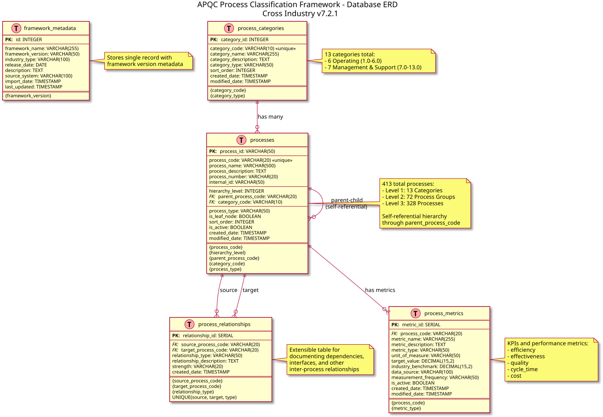
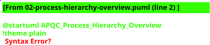

# APQC-framework
APQC process classification framework HOPEX Solution Pack

Speed up process definition with the APQC framework contents !

This updated HOPEX Solution Packs provides the latest process content frameworks. 
Cross Industry framework or more specific Industry framework can be used to speed up your process initiatives or
perform benchmarks using standard indicators.

See APQC website for more information about APQC 

Latest release date:
2020-01-10

Platform compatibility:
HOPEX V3 (minimum CP3)

Dependencies:
None

Licensing:
Free

Requirements:
HOPEX Business Process Analysis or other products providing access to Business Processes or Value Streams

Latest release notes:
The process hierarchy is provided both as Business Processes or Value Streams for level 1 and 2, and Value Streams for level 3

Activate Business Process option (from HOPEX V3.1) to view Business Process hierarchy

Activate Value Streams option to view Value Streams hierarchy

Installation procedure:
unzip the attached archive file into the solution pack folder (e.g.  \Utilities\Solution Pack)
follow the standard solution pack import procedure

---

## New: SQL Database & Reporting Solution

In addition to the HOPEX Solution Pack, this repository now includes a **complete SQL database implementation**, **comprehensive reporting package**, and **standalone Excel dataset** for the APQC Process Classification Framework v7.2.1.

### Excel Dataset (New!)

**Download:** [APQC-Cross-Industry-v7.2.1-Dataset.xlsx](APQC-Cross-Industry-v7.2.1-Dataset.xlsx)

**✓ 100% COMPLETE** - Verified and certified

A standalone Excel workbook with all APQC framework data:
- ✅ **No Database Required** - Ready to use immediately
- ✅ **5 Comprehensive Sheets** - Summary, Metadata, Categories, Processes, Hierarchy
- ✅ **413 Processes** - Complete Cross Industry framework (13 categories, 72 process groups, 328 processes)
- ✅ **Professional Formatting** - Color-coded, auto-sized columns
- ✅ **Multiple Views** - Detailed tables and hierarchical views
- ✅ **Universal Format** - Works in Excel, LibreOffice, Google Sheets
- ✅ **Verified Complete** - Automated verification confirms 100% data integrity

**Use Cases:**
- Quick reference and browsing
- Offline access to APQC framework
- Import into other tools
- Training and presentations
- Business process analysis

See [XLSX_DATASET_README.md](database/APQC-Cross-Industry-v7.2.1/XLSX_DATASET_README.md) for detailed documentation.

### Database Architecture



*Complete Entity-Relationship Diagram showing the normalized database structure with 5 tables, relationships, and constraints*

### Process Framework Overview



*High-level view of the APQC framework showing all 13 categories and 3 hierarchy levels*

### Features

- ✅ **SQL Database** - Full normalized database (PostgreSQL, MySQL, SQL Server)
- ✅ **413 Processes** - Complete Cross Industry framework with descriptions
- ✅ **4 Report Types** - Hierarchy, Table, Category Summary, Metrics
- ✅ **Multiple Formats** - CSV, HTML, Excel, SQL output
- ✅ **Automation Tools** - Python and Shell scripts for report generation
- ✅ **BI Integration** - Ready for Tableau, Power BI, Excel
- ✅ **UML Diagrams** - Comprehensive database and process visualizations
- ✅ **70KB+ Documentation** - Complete setup and usage guides

### Quick Links

- **[Database Documentation](database/APQC-Cross-Industry-v7.2.1/README.md)** - Setup and usage guide
- **[Reports Documentation](database/APQC-Cross-Industry-v7.2.1/reports/README.md)** - Report generation guide
- **[UML Diagrams & Visualizations](database/APQC-Cross-Industry-v7.2.1/diagrams/README.md)** - Interactive diagrams and PDF generation
- **[REPORTS.md](REPORTS.md)** - Quick overview of reporting capabilities

### Quick Start

```bash
# 1. Setup the database
cd database/APQC-Cross-Industry-v7.2.1
./setup_database.sh postgresql apqc_pcf

# 2. Generate reports
cd reports
python generate_reports.py --db postgresql --report all --format csv
```

### What's Included

**Database Package:**
- `01-schema.sql` - Database schema (5 tables)
- `02-data.sql` - All 413 processes with descriptions
- `03-views.sql` - Pre-built views
- `04-sample-metrics.sql` - Sample KPIs
- `05-verify.sql` - Verification script

**Report Package:**
- `01-process-hierarchy-report.sql` - Hierarchical process view
- `02-process-table-report.sql` - Complete process table (5 variations)
- `03-category-summary-report.sql` - Executive summaries
- `04-process-metrics-report.sql` - Performance metrics & KPIs
- `generate_reports.py` - Python report generator (CSV/HTML/Excel)
- `run_reports.sh` - Batch report generation script

### Use Cases

- **Process Management** - Document and manage organizational processes
- **Benchmarking** - Compare performance against industry standards
- **Compliance** - Generate audit and compliance reports
- **BI Integration** - Feed data to Tableau, Power BI, or Excel
- **Executive Reporting** - Category-level summaries and statistics

See **[REPORTS.md](REPORTS.md)** for complete reporting documentation.
