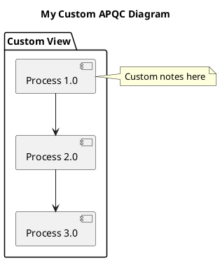

# APQC PCF UML Diagrams and Visualizations

## Overview

This directory contains comprehensive UML diagrams and visualization tools for the APQC Process Classification Framework (PCF) Cross Industry v7.2.1 database.

## Available Outputs

### 1. UML Diagrams (PlantUML)

#### Database ERD (`01-database-erd.puml`)
Complete Entity-Relationship Diagram showing:
- All 5 database tables
- Primary and foreign key relationships
- Table columns with data types
- Indexes and constraints
- Cardinality relationships
- Descriptive notes

**Output Formats:**
- SVG (vector, best for web)
- PNG (raster, for documents)
- PDF (for printing)

#### Process Hierarchy Overview (`02-process-hierarchy-overview.puml`)
High-level view of the APQC framework structure:
- 13 categories (Operating + Management & Support)
- Hierarchy levels overview
- Framework statistics

#### Detailed Category Diagrams (`03-category-*-detailed.puml`)
Detailed breakdown of individual categories:
- Category 1.0: Develop Vision and Strategy
- All process groups and processes
- Process flow indicators
- Hierarchical relationships

### 2. Interactive HTML Visualization

**File:** `interactive-visualization.html`

A single-page, interactive web application featuring:

**Features:**
- **Fully Interactive:** Click to expand/collapse categories and processes
- **Search Functionality:** Real-time search across all processes
- **Filter Options:** Filter by level, category type, or specific attributes
- **Responsive Design:** Works on desktop, tablet, and mobile
- **Statistics Dashboard:** Key metrics at a glance
- **Process Descriptions:** Click processes to view full descriptions
- **Professional Styling:** Modern UI with gradient backgrounds and smooth animations

**Navigation:**
- Category headers are clickable to expand/collapse
- Process groups can be toggled
- Individual processes show descriptions on click
- Search box filters in real-time
- Filter buttons for quick access to specific views

### 3. PDF Documentation

**File:** `apqc-pcf-report.pdf`

Comprehensive PDF report including:
- Title page with framework metadata
- Table of contents
- Introduction and overview
- Database schema documentation
- Process hierarchy explanation
- Complete category listings
- Detailed process descriptions for all 413 processes

**Sections:**
1. Introduction - Framework overview and key features
2. Database Schema - Table descriptions and relationships
3. Process Hierarchy - 3-level structure explanation
4. Process Categories - All 13 categories with descriptions
5. Detailed Listings - Every process with code and description
6. Appendix - Additional reference materials

## Installation

### Prerequisites

```bash
# Core requirements
pip install pandas psycopg2-binary

# For diagram generation
sudo apt-get install plantuml  # Linux
brew install plantuml          # macOS

# For interactive HTML
pip install jinja2

# For PDF generation
pip install reportlab pillow

# All requirements
pip install -r requirements.txt
```

### Required Tools

1. **PlantUML** - For UML diagram generation
   - Download: https://plantuml.com/download
   - Or install via package manager (see above)

2. **Graphviz** (optional, enhances PlantUML)
   ```bash
   sudo apt-get install graphviz  # Linux
   brew install graphviz          # macOS
   ```

## Usage

### Quick Start - Generate Everything

```bash
# Generate all outputs at once
python generate_diagrams.py --all

# Or generate with database connection
python generate_diagrams.py --all \
    --db-user postgres \
    --db-password yourpassword \
    --db-name apqc_pcf
```

### Generate Specific Outputs

```bash
# Generate only PlantUML diagrams
python generate_diagrams.py --erd --hierarchy

# Generate only interactive HTML
python generate_diagrams.py --html

# Generate only PDF
python generate_pdf.py --output apqc-report.pdf
```

### With Database Connection

```bash
# Full generation with database
python generate_diagrams.py --all \
    --db-host localhost \
    --db-port 5432 \
    --db-name apqc_pcf \
    --db-user myuser \
    --db-password mypass

# PDF with database
python generate_pdf.py \
    --db-user postgres \
    --db-password pass \
    --output comprehensive-report.pdf
```

### Manual PlantUML Generation

If you want to manually generate diagrams from .puml files:

```bash
# Generate SVG (best for web)
plantuml -tsvg *.puml

# Generate PNG (raster images)
plantuml -tpng *.puml

# Generate PDF (for printing)
plantuml -tpdf *.puml

# All formats at once
plantuml -tsvg -tpng -tpdf *.puml
```

## Output Files

After running the generators, you'll have:

```
diagrams/
├── 01-database-erd.puml              # Source: Database ERD
├── 01-database-erd.svg               # Output: ERD vector diagram
├── 01-database-erd.png               # Output: ERD raster diagram
├── 01-database-erd.pdf               # Output: ERD printable
│
├── 02-process-hierarchy-overview.puml
├── 02-process-hierarchy-overview.svg
├── 02-process-hierarchy-overview.png
├── 02-process-hierarchy-overview.pdf
│
├── 03-category-1-detailed.puml
├── 03-category-1-detailed.svg
├── 03-category-1-detailed.png
├── 03-category-1-detailed.pdf
│
├── interactive-visualization.html     # Interactive single-page app
├── apqc-pcf-report.pdf               # Comprehensive PDF report
│
├── generate_diagrams.py              # Main generator script
├── generate_pdf.py                   # PDF generator script
├── requirements.txt                  # Python dependencies
└── README.md                         # This file
```

## Features in Detail

### Database ERD Features

- **Complete Schema:** All tables, columns, and relationships
- **Visual Clarity:** Color-coded tables and clear relationship lines
- **Index Documentation:** Shows all database indexes
- **Notes:** Explanatory notes for each table
- **Professional Layout:** Organized for easy understanding

### Interactive HTML Features

- **Real-time Search:** Filter 413 processes instantly
- **Smart Filters:**
  - All Levels / Level 1 / Level 2 / Level 3
  - Operating categories
  - Management & Support categories
- **Expand/Collapse:** Navigate hierarchy efficiently
- **Statistics Dashboard:** Live counts and metrics
- **Responsive Design:** Works on all devices
- **Print-Friendly:** Clean print layout
- **No Dependencies:** Pure HTML/CSS/JavaScript, works offline

### PDF Report Features

- **Professional Layout:** Structured sections with table of contents
- **Complete Documentation:** All 413 processes documented
- **Tables and Lists:** Organized data presentation
- **Hierarchical View:** Clear parent-child relationships
- **Printable:** High-quality output for physical distribution
- **Bookmarks:** Easy navigation (if PDF viewer supports)

## Customization

### Adding New Diagrams

1. Create a new `.puml` file in this directory
2. Use PlantUML syntax: https://plantuml.com/
3. Run `generate_diagrams.py --erd --hierarchy` to generate outputs

Example PlantUML diagram:



### Customizing HTML

Edit `generate_diagrams.py` and modify the `html_template` string:
- Change colors in the CSS section
- Modify layout in the HTML structure
- Add new filters or features in JavaScript

### Customizing PDF

Edit `generate_pdf.py`:
- Modify styles in `__init__` method
- Add new sections in `generate_report` method
- Change page layout or fonts
- Add custom headers/footers

## Troubleshooting

### PlantUML Not Found

```bash
# Install PlantUML
sudo apt-get install plantuml  # Ubuntu/Debian
brew install plantuml          # macOS

# Or download JAR file
wget https://sourceforge.net/projects/plantuml/files/plantuml.jar/download
java -jar plantuml.jar -tsvg *.puml
```

### Database Connection Errors

```bash
# Check database is running
psql -h localhost -U postgres -d apqc_pcf

# Verify credentials
python -c "import psycopg2; psycopg2.connect(host='localhost', user='postgres', password='pass', database='apqc_pcf')"
```

### Missing Python Packages

```bash
# Install all requirements
pip install -r requirements.txt

# Or install individually
pip install pandas psycopg2-binary jinja2 reportlab pillow
```

### PDF Generation Issues

```bash
# Ensure reportlab is installed
pip install reportlab pillow

# For better font support
pip install reportlab[rlPyCairo]
```

## Integration with Other Tools

### Importing into Documentation

**Markdown Documents:**
```markdown

```

**HTML Pages:**
```html

```

**LaTeX Documents:**
```latex
\includegraphics[width=\textwidth]{diagrams/01-database-erd.pdf}
```

### Business Intelligence Tools

1. **Tableau:** Import interactive HTML or use database connection
2. **Power BI:** Embed HTML visualization or connect to database
3. **Confluence:** Upload PNG/SVG diagrams to wiki pages
4. **SharePoint:** Host interactive HTML for team access

### Presentations

- Use PNG diagrams in PowerPoint/Google Slides
- Export PDF sections for printed handouts
- Show interactive HTML during live demos

## Best Practices

1. **Version Control:** Commit `.puml` source files, not generated outputs
2. **Regenerate Regularly:** Update diagrams when database schema changes
3. **Documentation:** Add notes to PlantUML diagrams for clarity
4. **Testing:** Preview HTML in multiple browsers
5. **Distribution:** Share PDF for offline access, HTML for interactive use

## Advanced Usage

### Batch Processing

```bash
#!/bin/bash
# Generate all outputs daily

cd /path/to/diagrams

# Generate diagrams
python generate_diagrams.py --all \
    --db-user $DB_USER \
    --db-password $DB_PASS

# Generate PDF
python generate_pdf.py \
    --db-user $DB_USER \
    --db-password $DB_PASS \
    --output "apqc-report-$(date +%Y%m%d).pdf"

# Archive old files
mkdir -p archive/$(date +%Y%m)
mv *.pdf archive/$(date +%Y%m)/ 2>/dev/null || true
```

### Automation with Cron

```bash
# Edit crontab
crontab -e

# Add daily generation at 2 AM
0 2 * * * cd /path/to/diagrams && ./batch_generate.sh
```

## Support

For issues or questions:
1. Check this README
2. Review the main database README
3. Check PlantUML documentation: https://plantuml.com/
4. Review reportlab docs: https://www.reportlab.com/

## Version History

| Version | Date | Changes |
|---------|------|---------|
| 1.0 | 2026-03-25 | Initial UML and visualization package |

## License

This visualization package is part of the APQC PCF database project.
See main repository LICENSE for details.

---

**Package Created:** 2026-03-25
**APQC PCF Version:** 7.2.1 Cross Industry
**Supported Formats:** PlantUML, SVG, PNG, PDF, HTML
